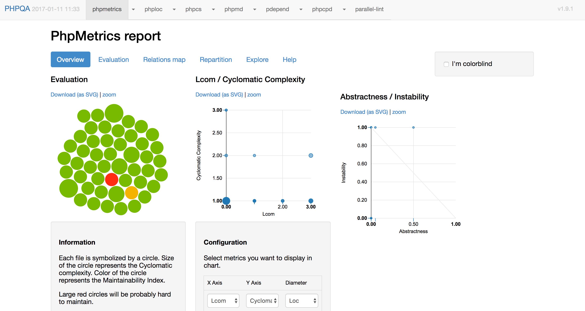

title: 分析 PHP 程式碼品質
date: 2017-01-11 18:29:49
tags: ["PHP"]
---

前兩天 Laravel 老爸 Taylor 分享了他對幾個知名的 framework 所做的[程式碼品質分析](https://medium.com/@taylorotwell/measuring-code-complexity-64356da605f9#.i9ah5inwx)，引起了社群很大的[討論](https://www.facebook.com/groups/laravel.tw/permalink/1200376173364763/)。

因此，我想藉機分享一下：

* 如何對 PHP 程式碼做分析。
* 分析出來的數值有什麼意義。

<!-- more -->

## PHP 程式碼分析工具

PHP 程式碼分析工具其實有很多，但一一安裝其實很花時間。這裡我推薦一個套件： [PHPQA](https://github.com/EdgedesignCZ/phpqa) ，它已經把以下常用的 PHP 程式碼分析工具整合在一個命令列裡了：

* [phploc](https://github.com/sebastianbergmann/phploc) - 測試 PHP 專案的大小 (即程式碼行數等資訊)
* [phpcpd](https://github.com/sebastianbergmann/phpcpd) - 重複程式偵測
* [phpcs](https://github.com/squizlabs/PHP_CodeSniffer) - 程式碼風格檢查
* [pdepend](https://github.com/pdepend/pdepend) - 程式碼依賴度檢查
* [phpmd](https://github.com/phpmd/phpmd) - 找出專案複雜度過高的程式碼
* [phpmetrics](https://github.com/Halleck45/PhpMetrics) - PHP 程式碼靜態分析
* [parallel-lint](https://github.com/JakubOnderka/PHP-Parallel-Lint) - 同時檢查多個 PHP 檔案的語法
* [phpstan](https://github.com/phpstan/phpstan) - 在還沒執行程式前就找到可能的 bug (結果它本身也有 bug )

PHPQA 的安裝方式很簡單，用 composer 全域安裝即可：

```bash
$ composer global require edgedesign/phpqa --update-no-dev
```

不過這時候安裝的 `phpcpd 2.0.4` 會有[問題](https://github.com/sebastianbergmann/phpcpd/issues/132)，所以要安裝 `dev-master` 版：

```bash
$ composer global require sebastian/phpcpd:dev-master
```

現在可以確認一下是否有安裝成功了，執行：

```bash
$ phpqa tools
+---------------+------------+----------------------------------------------+
| Tool          | Version    | Authors                                      |
+---------------+------------+----------------------------------------------+
| phpqa         | 1.9.1      | Zdenek Drahos                                |
| phpmetrics    | 1.10.0     | Jean-François Lépine                         |
| phploc        | 3.0.1      | Sebastian Bergmann                           |
| phpcs         | 2.7.1      | Greg Sherwood                                |
| phpmd         | 2.5.0      | Manuel Pichler,Other contributors,Marc Würth |
| pdepend       | 2.3.2      |                                              |
| phpcpd        | dev-master | Sebastian Bergmann                           |
| parallel-lint | 0.9.2      | Jakub Onderka                                |
+---------------+------------+----------------------------------------------+
```

> 記得確認一下 `$HOME/.composer/vendor/bin` 有在你的 `$PATH` 環境變數裡，不然沒辦法執行安裝好的指令。

## 用 PHPQA 產生分析報表

現在可以找一個 PHP 專案來試試 `phpqa` ，這裡我直接用一個新的 Laravel 專案來實驗：

```bash
$ laravel new qa-example
$ cd qa-example
```

然後執行 `phpqa` 來跑出報表：

```bash
$ phpqa --ignoredDirs vendor --report
```

執行結果如下：

```
... (略) ...
[phpqa]
+---------------+----------------+--------------+--------+---------------------------+
| Tool          | Allowed Errors | Errors count | Is OK? | HTML report               |
+---------------+----------------+--------------+--------+---------------------------+
| phpmetrics    |                |              | ✓      | build//phpmetrics.html    |
| phploc        |                |              | ✓      | build//phploc.html        |
| phpcs         |                | 26           | ✓      | build//phpcs.html         |
| phpmd         |                | 4            | ✓      | build//phpmd.html         |
| pdepend       |                |              | ✓      | build//pdepend.html       |
| phpcpd        |                | 0            | ✓      | build//phpcpd.html        |
| parallel-lint |                | 0            | ✓      | build//parallel-lint.html |
+---------------+----------------+--------------+--------+---------------------------+
| phpqa         |                | 30           | ✓      | build//phpqa.html         |
+---------------+----------------+--------------+--------+---------------------------+

[phpqa] No failed tools
```

這樣 `phpqa` 就會在專案下建立 `build` 資料夾，裡面就會放著所有分析報表；我們只需要打開 `build/phpqa.html` 就可以看到所有的報表了。



更好的做法是把它們整合到 CI 自動化流程裡，這樣每一次 push 程式碼後就可以自動產生這些報表。

## 各報表的意義

這裡僅簡單介紹每個報表的意義，詳細的介紹就請大家參考官方說明。

`PhpMetrics report` 本身就包含了多種面向的分析，像是複雜度、相依性、程式碼大小等資訊。在 `Explore` 頁籤上可以瀏覽到所有檔案的分析指標，這些指標可以從官方網站上找到[它們的說明](http://www.phpmetrics.org/documentation/index.html)。

`phploc report` 主要是列出專案的程式碼大小，但會細分出一些資訊；比較重要的資訊像是：邏輯總行數 (LLOC) 、最大類別行數 (Maximum Class Length) 、最大函式行數 (Maximum Method Length) 。通常類別行數或函式行數小表示有較佳的程式碼品質，因為小類別與小函式較容易專注在一件事上，可讀性與可維護性都會好一些。

`phpcs report` 主要會列出每支 PHP 檔中不符合程式碼風格規範的地方，預設的程式碼規範是 PSR2 。

`phpmd report` 會列出一些糟糕的程式碼，像是定義後卻沒有用到的變數、或是變數名稱過於簡略等。詳細的規則可以參考官方手冊的 [Rules](https://phpmd.org/rules/index.html) 說明。

`PDepend report` 也跟 `PhpMetrics` 一樣同時包含了多種指標，不同的是它對每個類別所相依的類別會有比較清楚的列表，而不是用連接線來表示。這裡的各項指標主要是影響類別的穩定度與耦合度，例如抽象類依賴太多實體類別，那麼耦合度就會很高；如果有太多實體類別的互動，那麼穩定度就會下降。

`phpcpd report` 會列出有複製貼上程式碼的檔案以及重複出現的行數。 `phpcpd` 也是 `PHPUnit` 老爸的作品。

`parallel-lint` 會列出有 PHP 語法錯誤的檔案，預設會用當下的 PHP 版本來驗證。

## 總結

就像在平常開發時，我們會從程式碼測試覆蓋率報表中看出還有沒有值得加強測試的部份；而利用 phpqa 所分析出來的這些報表其實也是讓我們瞭解目前程式碼的現狀，進而從這些指標找出可能有問題的地方來加以重構。

希望這樣的介紹可以讓大家開始用這些工具來時時關心自己的程式碼品質，早一步分析出程式碼中潛藏的問題，這樣一來我們就可以把時間花在值得修改的地方。

